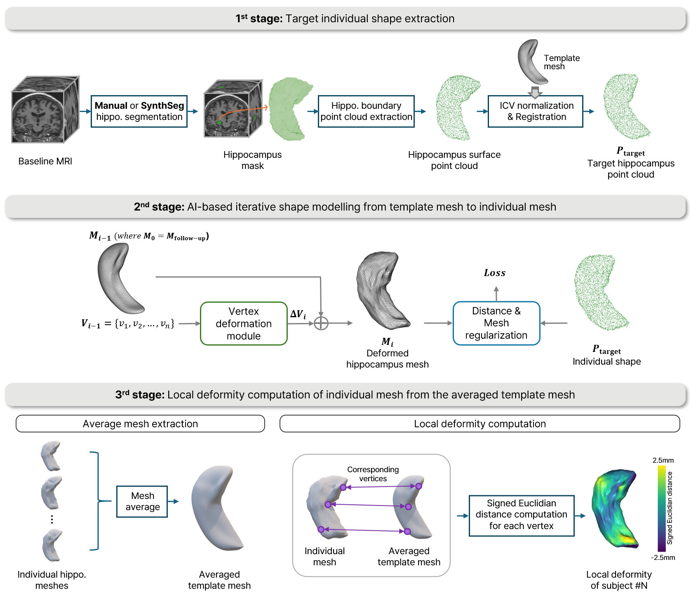

# BrainSubcorticalStrucutre
Brain Subcortical Strucutre Mesh Reconstruction from Template Mesh

This is the official code for the paper "AI-based deformable hippocampal mesh reflects hippocampal morphological characteristics in relation to cognition in healthy older adults", W. Park., M. Hernandez, et al., medRxiv. doi:https://doi.org/10.1101/2024.10.28.24316272.

This is the code for the pipeline of subcortical structure reconstruction from a template mesh.
We provide the codes for
1. generation of template mesh
2. Optimization of individual subcortical structures from the template mesh with the deep learning architecture (pointnet-based).
3. Extraction of the local deformity from the template mesh.

We provide the template meshes in ```whole_brain_strucutre/temp_meshes``` as below.


The overall pipeline is following.




